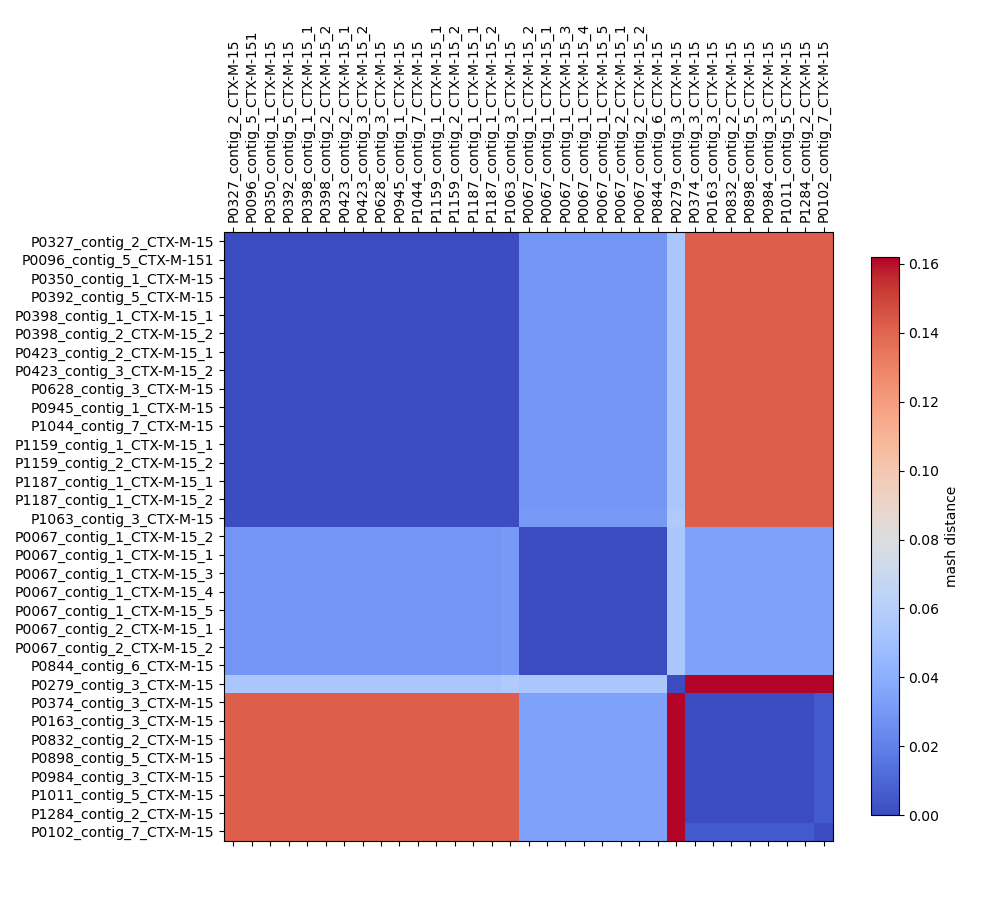

# bla CTX-M-15 context analysis

This repository contains a preliminary analysis for the structural diversity of contexts 1kbp upstream of the bla CTX-M-15 gene. The analysis is performed using _pangenome graphs_ generated by [PanGraph](https://github.com/neherlab/pangraph)

## setup

Different packages are required for the analysis (e.g. biopython, numpy, matplotlib, pandas, mafft, mash, scipy...). These can be installed using [conda](https://docs.conda.io/en/latest/) through the provided conda environment file `conda_env.yml`:

```bash
conda env create -f conda_env.yml -n bla-env
```

Moreover for the creation of the pangenome graph, [PanGraph](https://github.com/neherlab/pangraph) must be installed and available on your path. The installation instructions are available [here](https://neherlab.github.io/pangraph/#Installation)

## running the analysis

The script `analysis.sh` contains all of the steps of the analysis:

- _pangenome graph_ creation and polishing.
- evaluation of MASH distance between isolates, used to decide the order of entries in the figures and group similar sequences together.
- generation of the figures.
- extraction of alignment for every _block_ of the pangenome graph.

This can be run by first activating the environment and then running the script:

```bash
conda activate bla-env
bash analysis.sh
```

## analysis results summary

We use [MASH](https://github.com/marbl/Mash) to evaluate an alignment-free distance between isolates. By performing hierarchical clustering on the resulting distance matrix we can order the isolates so as to group more similar sequences together. This shows three main structural clades, with one outlier (`P0279_contig_3_CTX-M-15`).



The script `analysis.py` also generates a linear representation for the pangenome graph. Blocks are represented in different colors, with blocks occurring only once being represented in gray. The first four letters of the block name are reported for every block. The final block `ABVFBXCQSS` is present in all isolates. Moving left from it we find first a split in the three main clades.


The table below gives some summary statistics for each block: number of block occurrences, number of isolates in which the block is present, block consensus length, whether the block is duplicated and whether is a core block present in every isolate.

|            | count | n. strains |  len | duplicated | core  |
| :--------- | ----: | ---------: | ---: | :--------- | :---- |
| ABVFBXCQSS |    33 |         33 |   72 | False      | True  |
| DFKNNMJVVE |    24 |         24 |  198 | False      | False |
| OWOAJQKRPJ |    25 |         25 |  275 | False      | False |
| IDEAAHPZZX |    16 |         16 |  455 | False      | False |
| EJEVQXSONK |    16 |         16 |  455 | False      | False |
| TKMAGWGJLQ |     8 |          8 |  365 | False      | False |
| OKQWKXEDAL |     7 |          7 |  108 | False      | False |
| NUNRRBEPHS |     1 |          1 |  653 | False      | False |
| ZXLWLYIAHU |     1 |          1 |  108 | False      | False |

In the folder `results/alignments` we export the alignments for every block. These can be inspected with software such as [AliView](https://ormbunkar.se/aliview/). Below is the visualization of the alignment for block `ABVFBXCQSS`.

